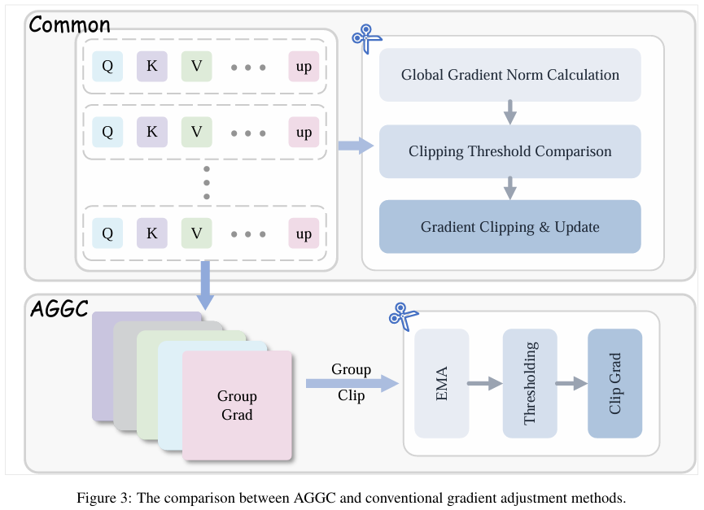
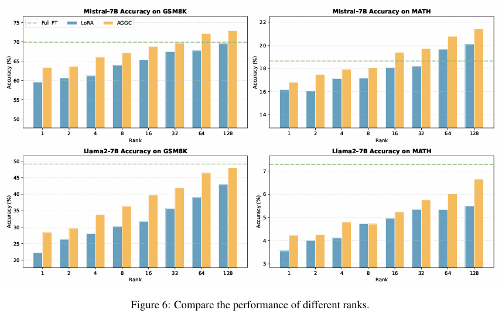
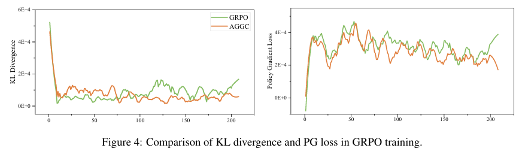
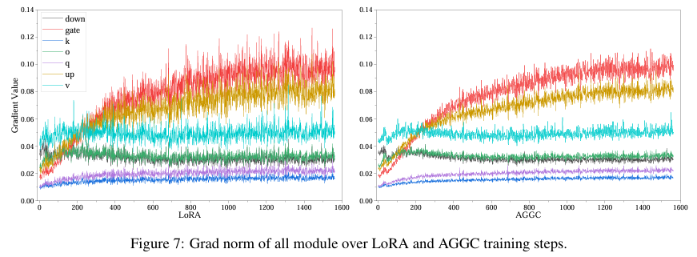

# AGGC: Adaptive Group Gradient Clipping for Stabilizing Large Language Model Training

## Introduction
We introduce Adaptive Group-wise Gradient Clipping (AGGC), a novel optimization strategy formulated to enhance the stability of Large Language Model (LLM) training by mitigating the constraints inherent to traditional global norm clipping techniques. In contrast to conventional methodologies, which often rely on the simplifying assumption of gradient homogeneity across all functional modules and consequently suffer from deleterious spill-over effects, AGGC operates by partitioning model parameters into distinct groups based on their functional attributes. Each group is then regulated independently through the application of an Exponential Moving Average (EMA) of historical gradient norms.

The proposed framework establishes adaptive bidirectional intervals, denoted as [Lj(t), Uj(t)], to concurrently address the challenges of gradient explosion and gradient vanishing. Furthermore, AGGC incorporates a time-dependent scheduling mechanism to maintain an optimal balance between exploratory learning in the early stages and convergent stability in the latter phases of training.
Empirical evaluations conducted across a diverse spectrum of tasks and model architectures, including LLaMA 2-7B, Mistral-7B, Gemma-7B, and DeBERTa-v3-base, demonstrate that AGGC consistently outperforms LoRA and frequently surpasses Full Fine-Tuning. Specifically, on the GSM8K benchmark, Mistral-7B fine-tuned with AGGC achieves an accuracy of 72.93 percent, exceeding LoRA's performance of 69.5 percent. On the GLUE benchmark, AGGC attains the highest overall average score of 90.1 percent among all evaluated strategies.

Beyond supervised fine-tuning, AGGC effectively stabilizes reinforcement learning pipelines, such as RLVR, thereby enhancing the logical deduction capabilities of models including Qwen 2.5 and Llama 3.2. Characterized by its lightweight design and minimal computational overhead, AGGC is engineered for seamless integration into existing post-training workflows. As such, it presents a robust and efficient solution to the pervasive issues of gradient heterogeneity and training instability in large-scale language models.






## News
- [2026.01.21] The first version of the paper is released on [arXiv](https://arxiv.org/abs/2601.11864).

## Quick Start

### LoRA
Our LoRA code is based on the modification of Pissa, so you can install it by referring to [Pissa](https://github.com/GraphPKU/PiSSA).

### GRPO
Our GRPO code is based on the modification of Verl, so you can install it by referring to [Verl](https://github.com/volcengine/verl).


### Training
Running the following script will automatically download the model, then start training:
```
sh LoRA/scripts/*/run_lora_AGGC.sh
sh GRPO/my_scripts/run_qwen2.5-3b_gsm8k.sh
```

### Evaluation
To evaluate the performance of LoRA model, please follow the instructions in [fxmeng/pissa-dataset](https://huggingface.co/datasets/fxmeng/pissa-dataset).

To evaluate the performance of Verl model, please follow the instructions:
```
sh GRPO/my_scripts/merge_ckpt/merge.sh
sh GRPO/my_scripts/Qwen2.5-Eval/evaluation/sh/eval_gsm8k.sh
```


## Citation
```
@article{li2026aggc,
  title={AGGC: Adaptive Group Gradient Clipping for Stabilizing Large Language Model Training},
  author={Li, Zhiyuan and Wu, Yuan and Chang, Yi},
  journal={arXiv preprint arXiv:2601.11864},
  year={2026}
}
```
